# actions-sandbox

* Subject: GitHub ActionsでmainとdevelopブランチへのPull Requestに対して自動テストを設定する

# 概要

Github Actions （以降、「Actions」と略記）を用いてNode.jsでCI（Unit Testを自動実行してPassしている状態を保つ、を意図）する方法を記載する。

次を目的とする。

* masterとdevelopブランチに対するPull Requestが作成された際に、**Request元のブランチ**に対して「`npm run test`」が実行されるようにする

なお、本記事の記載内容は、次の公式ドキュメントに記載の内容とほぼ同じである。
本記事は「実際にやってみると、こういう手順になる」を示すことを目的とする。

* Building and testing Node.js - GitHub Docs
    * https://docs.github.com/en/actions/automating-builds-and-tests/building-and-testing-nodejs


また、先のドキュメント「`Building and testing Node.js`」は、Node.jsでのCIに特化したサンプルを提供してくれているが、Actionsの一般的な使い方の観点では、次の記事を先に読む、もしくはその記事に従ってworkflowをゼロから作成してみる、のも良いかもしれない。

* Learn GitHub Actions ＞ Understanding GitHub Actions
    * https://docs.github.com/en/actions/learn-github-actions/understanding-github-actions

## 動作環境とサンプルコード

次の環境で動作確認をした。

```
node --version 
v16.13.2
```

```
  "devDependencies": {
    "chai": "^4.3.6",
    "cross-env": "^7.0.3",
    "mocha": "^10.0.0"
  }
```

動作確認に用いたサンプルコードは、本リポジトリを参照。


# テスト自動実行のためのActionsの設定手順

次のようなリポジトリがあった、と仮定する。

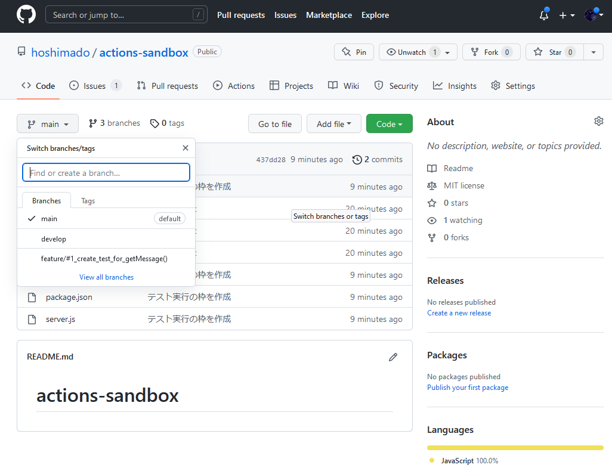

この時点では、Actionsは何も設定されていない。
またブランチ「`feature/#1_create_test_for_getMessage()`」で
「これからテストコードを追加する」
状態である。
これは「機能をまだ追加していない＝テストを実行すると失敗する状況」を敢えて作成している、事だけが意図である。
従って、本記事の手順を辿るうえで「テストは成功する」状態からスターとして問題ない（その場合は、本記事で述べる「テストが失敗する状態となる」がSkipされるだけである）。

このリポジトリにActionsを追加するには、次の公式ガイドのに従って、「`Node.js starter workflow`」をベースに編集する。

* Building and testing Node.js
    * https://docs.github.com/en/actions/automating-builds-and-tests/building-and-testing-nodejs

具体的には次のように操作する。

1. GitHubのブラウザUI上で「Actoins」タブをクリックして移動する
    * 「Get Started with GitHub Actions」ページが表示され、リポジトリに格納したコードがNode.jsであることから「お勧め」として「`Node.js By GitHub Actions`」が表示されている。これは、GitHub公式のstarter workflowである
    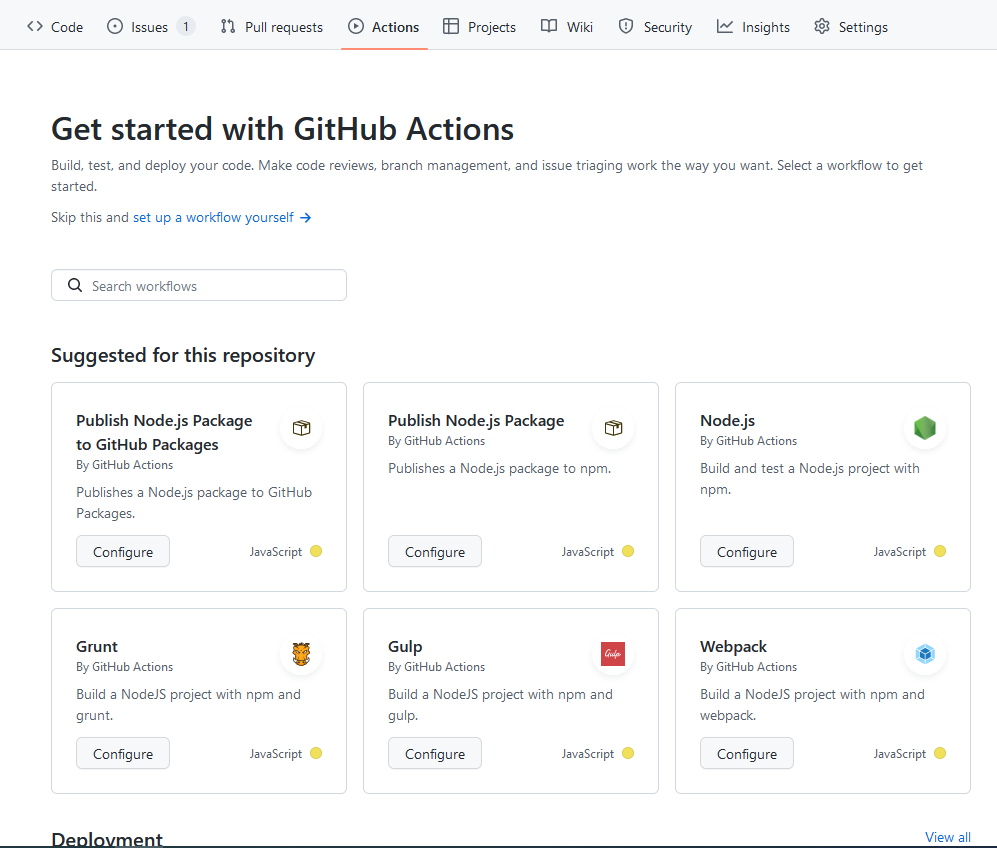
1. 「`Node.js By GitHub Actions`」（このスクリーンショットでは1段目の右端にある）の「Configure」ボタンを押下する
1. 次のように、作成済みのワークフローが編集画面として表示されるので、これを編集する
    * 標準では「mainリポジトリに対してpushもしくはPull Requestが行われた時にテストを実行する」となっている
    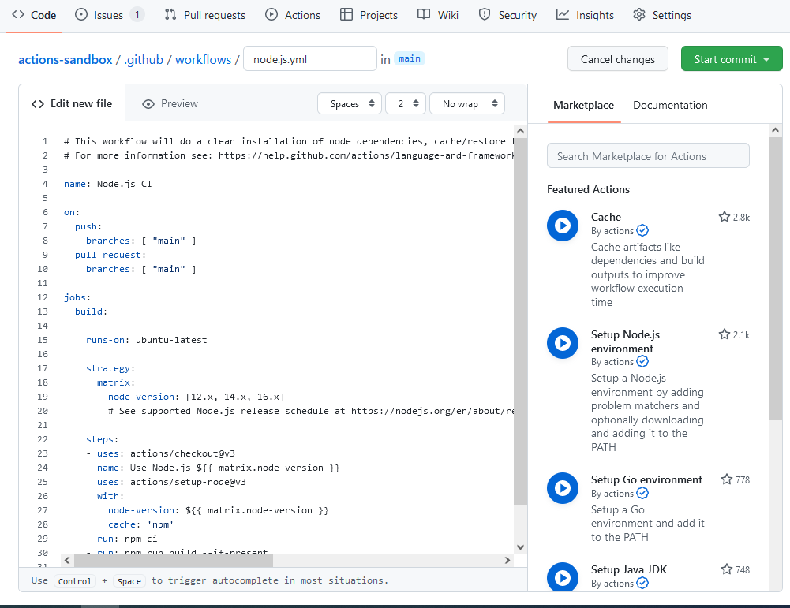
1. 表示されたワークフローを「mainもしくはdevelopリポジトリに対してPull Requestが作成された時に、Request元のブランチに対してテストを実行する」に変更する
    * 具体的には、次の2か所を編集する
        * 「`push`」の項目をコメントアウトし、「`pull_request`」の項目の対象ブランチにdevelopを追加する
        * 「`workflow_dispatch:`」の項目を追加（GitHubブラウザUI上から、試行としてAction実行できるようにするため）
    * なおファイル名は「`node.js.ci.yml`」に変更した
    * 編集後の状態は次のスクリーンショットの通り（ここでは、ついでなのでいくつかのコメントを追記している）
    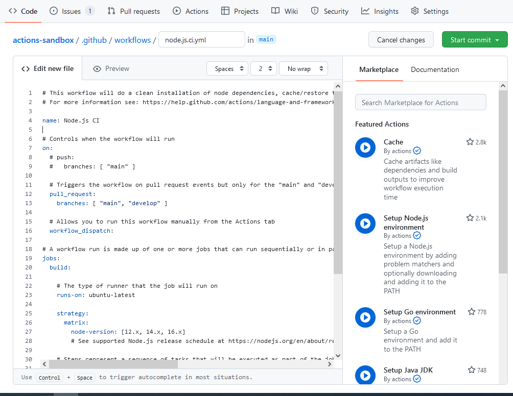
1. 編集を終えたら、右上にある「Start commit」ボタンを押す。コミットコメントを入力するダイアログが表示されるので任意に入力後、「commit new file」ボタンを押下する（この例では、何もコメント入れずにデフォルトのままでボタン押下した）
    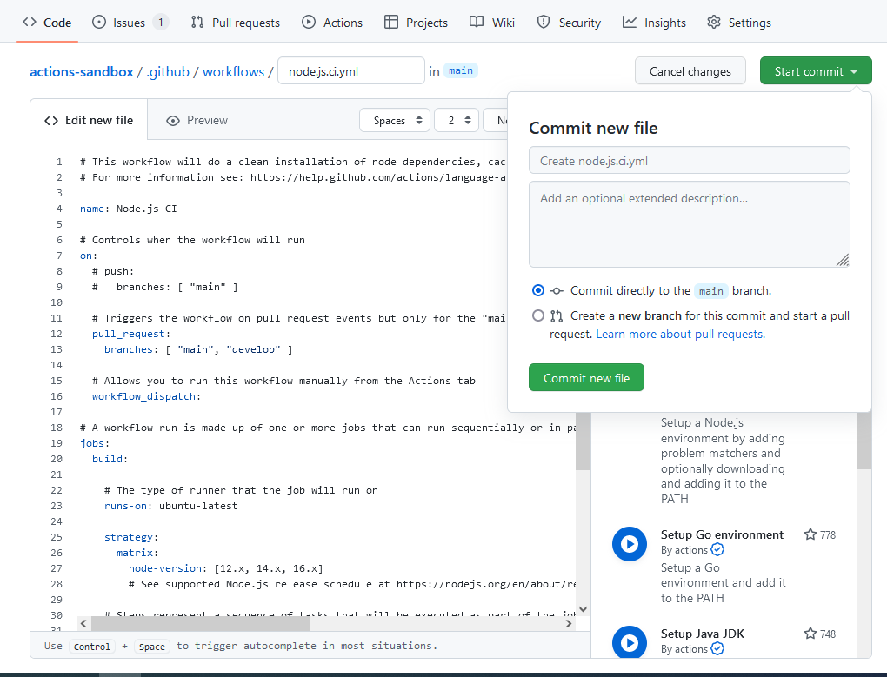
1. 「Code」タブに遷移する。以降、ワークフローを編集するときは、他のファイル群と同じように「Code」タブから辿ればよい（もちろん、ローカルにCloneして編集してコミットすることも可能）
    
1. 動作状況の確認のため「Action」タブに再び移動する。
    * この時点ではまだ何も実行されていない
1. 「Run workflow」ボタンを押下して表示されたダイアログ上の「Run workflow」ボタンを押下して、作成したワークフローを手動実行する
    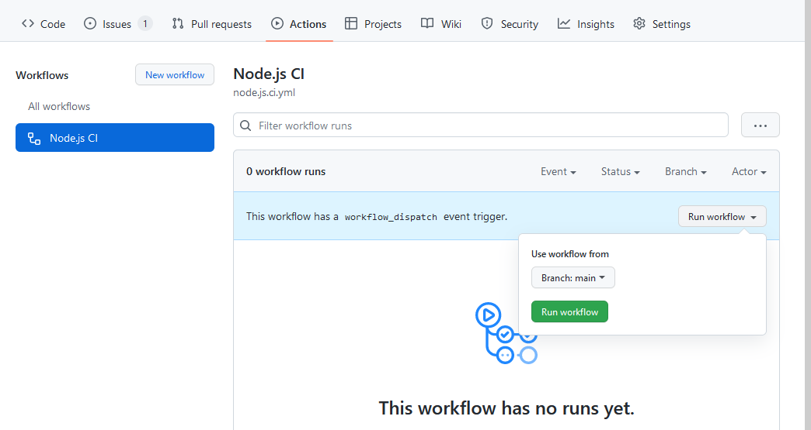
    * なお参考までに、デフォルトのワークフローでは「`push`」が定義されているので、そのままcommitした場合は「`mainリポジトリにpush`」の条件に該当するので、この時点で「実行」される
    * 先の編集時に「`workflow_dispatch:`」を追加しておかないと「Run workflow」ボタンは表示されないので注意
1. 実行画面に遷移するが、暫くすると「失敗」で終了する
    * 実行中の画面
    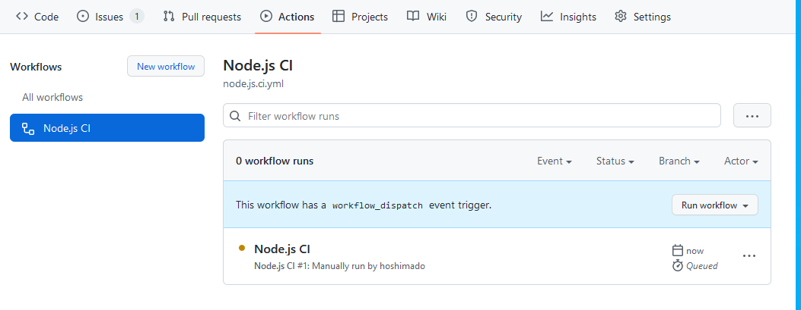
    * 「Node.js CI」（はワークフローの`name`に記載した名称が表示される）をクリックすると実行結果を参照できる。今回の例では、「`Run npm test`」のところで「対象のテストコードが無い」としてエラーしている。未だ追加していないので、期待通りのエラー内容
    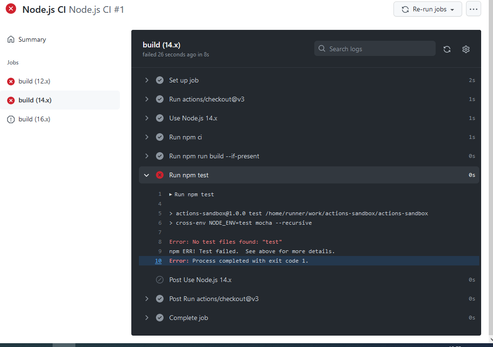

以上でActionsへのワークフローの設定は完了、、、なのだが、実はもう1工程、設定作業が必要。それは後述するとして、先ずは現状の動作を説明する。


ここまでの設定を終えた状態で、テストコードをブランチ「`feature/#1_create_test_for_getMessage()`」に追加し、ローカルで「テストが成功」する状態まで仕上げてからコミット＆プッシュする。

続いて、「`feature/#1_create_test_for_getMessage()`」から「`develop`」ブランチに対して Pull Requestを作成してみる（まだMergeはしない）。

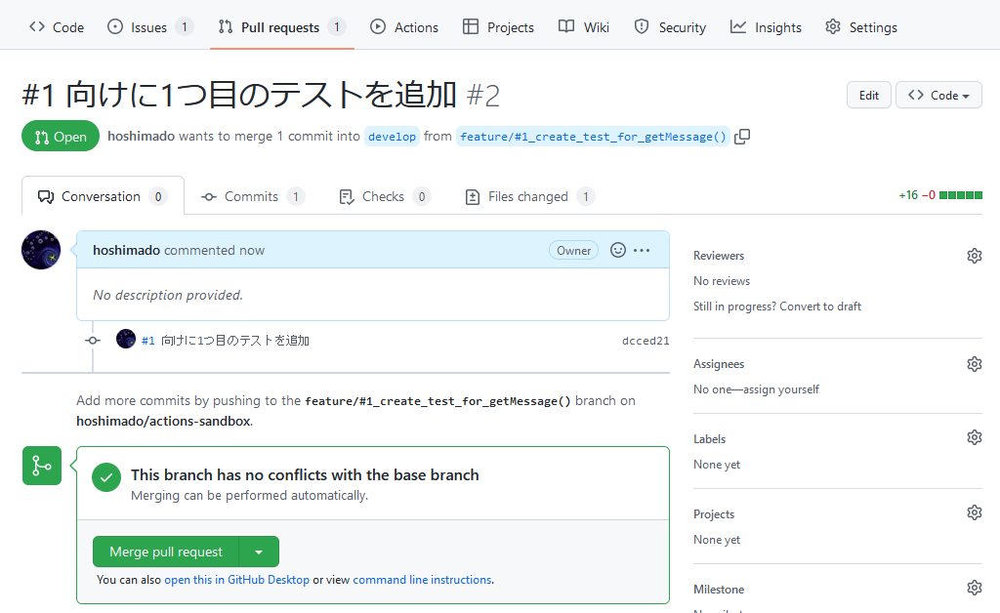

作成後にActionsタブを見に行ってみると、ワークフローは**何も実行されていない**。

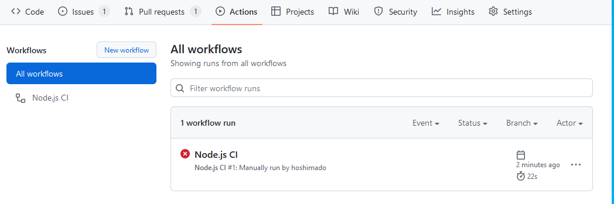

ひとまずdevelopブランチに対してのPull RequestをMergeする。

つづいて、developブランチからmainブランチに対してPull Requestを作成する。すると今度は、作成の数瞬後にActionsに定義したワークフローが走り始める。

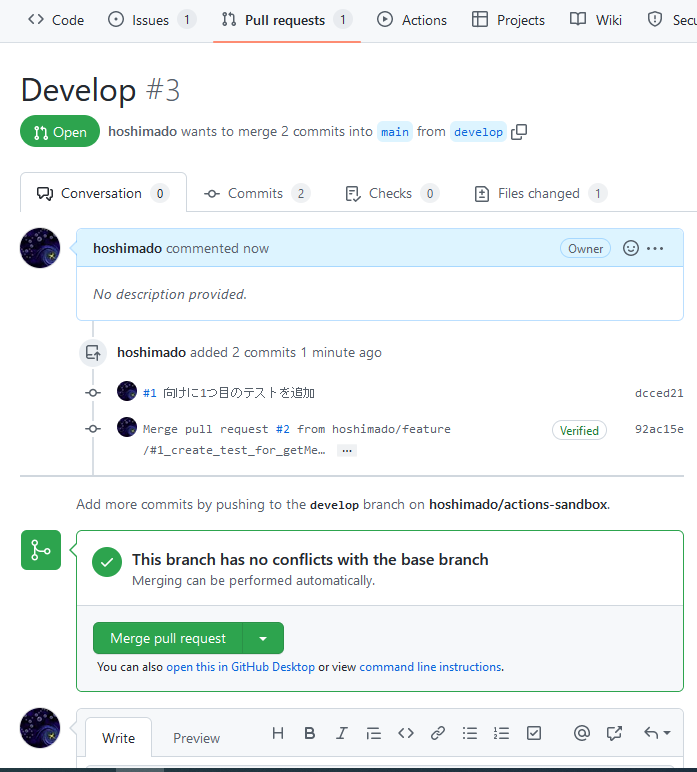

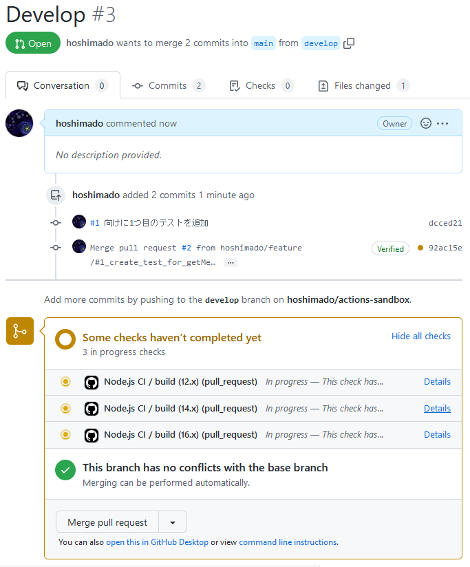

暫くすると、「テストが問題なく完了した」表示に変わる。これは期待した動作なので、このままPull RequestはmainブランチへMergeしておく。

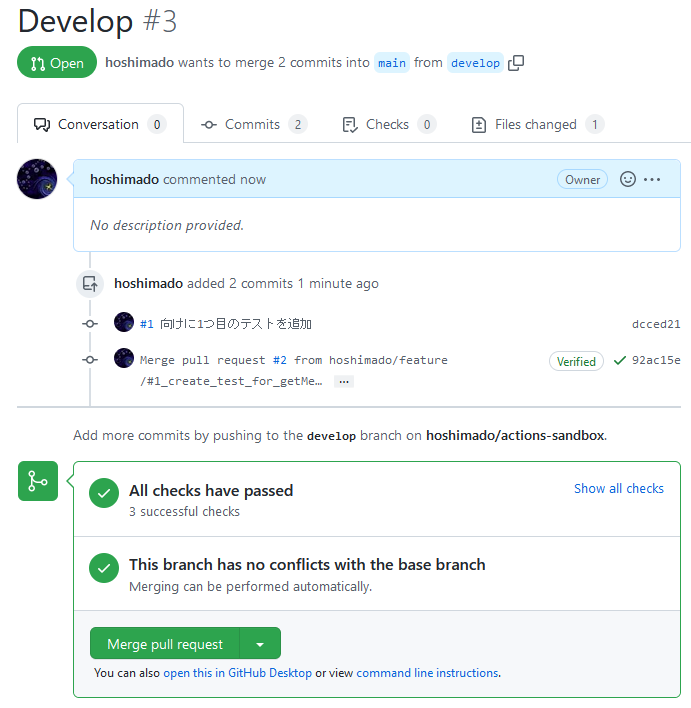

「Actions」タブを見に行くと、「`develop`ブランチに対して、ワークフローで定義したアクション（＝テストの実行）が実施されている」事を確認できる。

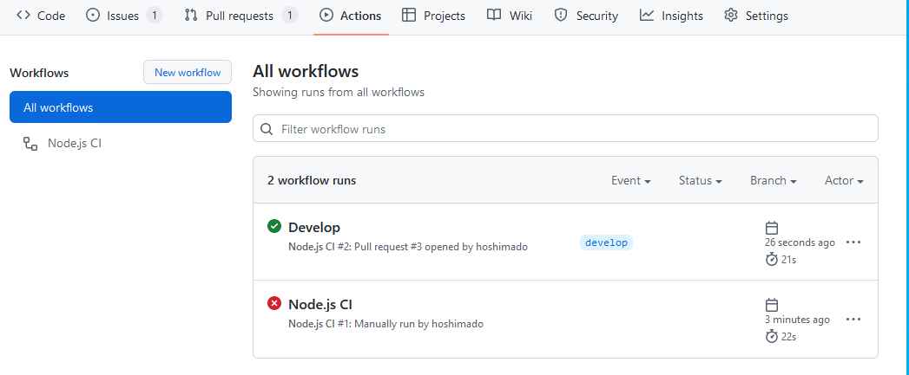


従って「`main`ブランチに対するPull Requestに対しては期待した動作をするが、`develop`ブランチに対してはNot」という状態。

これは「`develop`ブランチに、ワークフローの定義ファイルが格納されていない」事が原因。

公式ガイドの「Learn GitHub Actions ＞ Understanding GitHub Actions ＞ Events」に以下の記載があり、

> For a complete list of events that can be used to trigger workflows, see Events that trigger workflows.

辿った先の、「About events that trigger workflows」にある記載

> Workflow triggers are events that cause a workflow to run. For more information about how to use workflow triggers, see "Triggering a workflow."

から、さらに辿った「Using workflows ＞ Triggering a workflow」に次の記述があり、「トリガーとするイベントは、**ワークフローファイルが置かれたリポジトリのみ**である」ことが理由。

> Events that occur in your workflow's repository

* Learn GitHub Actions ＞ Understanding GitHub Actions ＞ Events
    * https://docs.github.com/en/actions/learn-github-actions/understanding-github-actions#events

* Using workflows ＞ Triggering a workflow
    * https://docs.github.com/en/actions/using-workflows/triggering-a-workflow

従って、`develop`ブランチにも先のワークフローファイルを同様に配置することで解決する。たとえば、「developブランチへ、mainブランチをマージする」でも「ローカルでコピーして、developブランチへ配置する」でもよい。

本記事の例では、次のようにGitHub Desktopアプリを用いて、「developブランチに対して、mainブランチをマージ」することで、`develop`ブランチに対しても同じワークフローファイルを設定した。

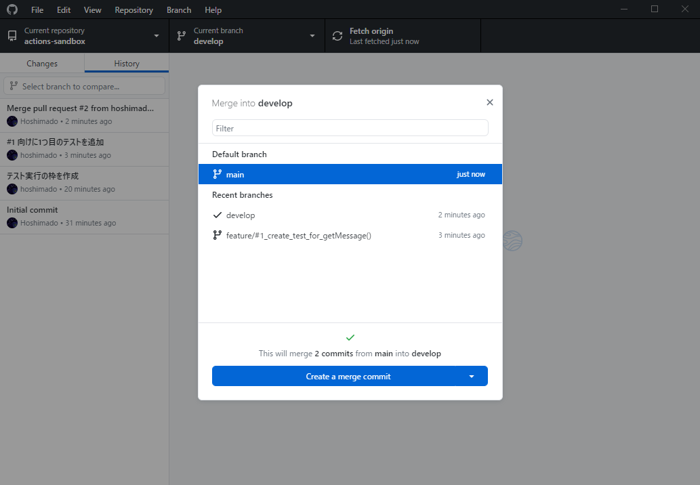

developブランチにおいてもワークフローファイルが配置された状況で、ブランチ「`feature/#1_create_test_for_getMessage()`」にて新しく機能追加を行い、developブランチに対するPull Requestを作成すると、今度はActionsに定義したワークフローが実行される。

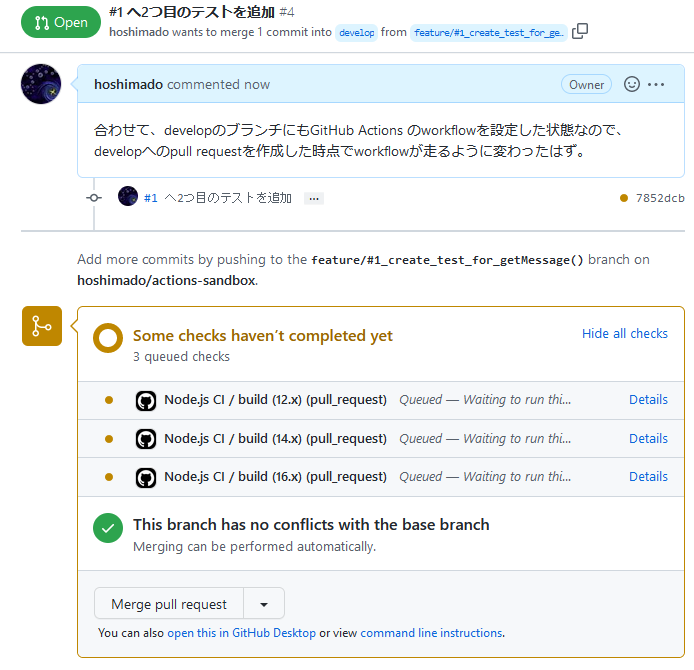

実際に「Actions」タブで実行状況を確認すると、ブランチ「`feature/#1_create_test_for_getMessage()`」に対してテストが実行されたことが分かる。

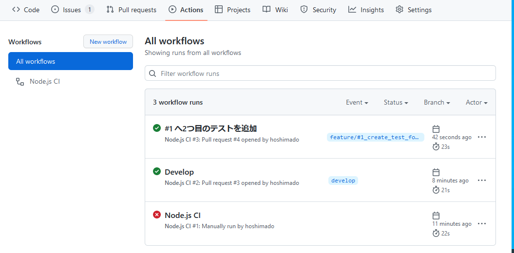

本記事の解説目的「mainだけでなく、developブランチに対するPull Requestの対してもActionsで定義したワークフローを動作させる」は、以上。


# 補足

本記事では、「Get Started with GitHub Actions」ページのところで、「お勧め」として表示された「starter workflow」である「`Node.js By GitHub Actions`」を利用したが、こちらを利用せずにゼロからワークフローを作成することも可能。

その場合は、上部にある「Skip this and」に続く「`set up a workflow yourself`」リンクを押下する。


すると、次のような画面に遷移する。
ベースとなるサンプルが表示されているので、これをもとに任意にワークフローを作成することが出来る。
ワークフローの記述方法、と言う観点ではこちらのサンプルコードの方がコメントが丁寧なので、分かり易いと思う。

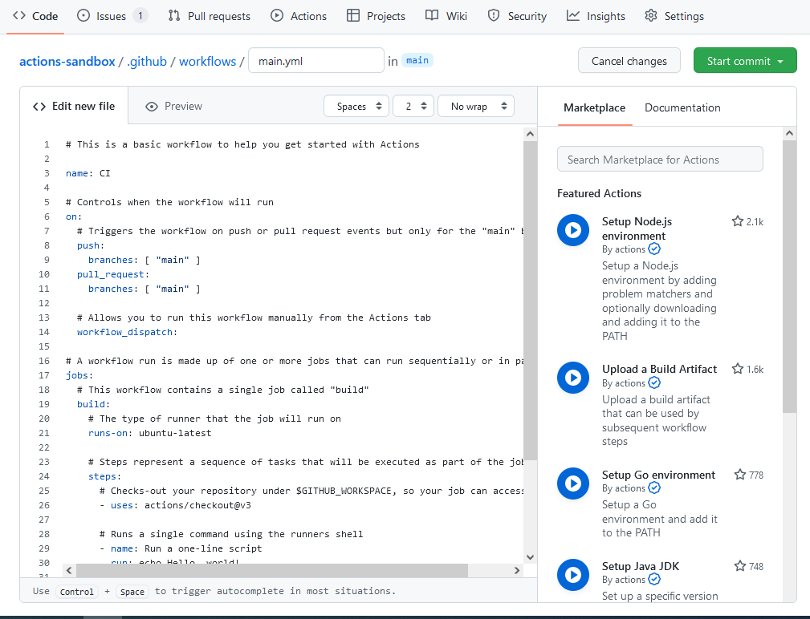

公式ガイドの「Understanding GitHub Actions」に従って進む場合は、たぶんこちらが期待値。

* Learn GitHub Actions
    * https://docs.github.com/en/actions/learn-github-actions/understanding-github-actions


